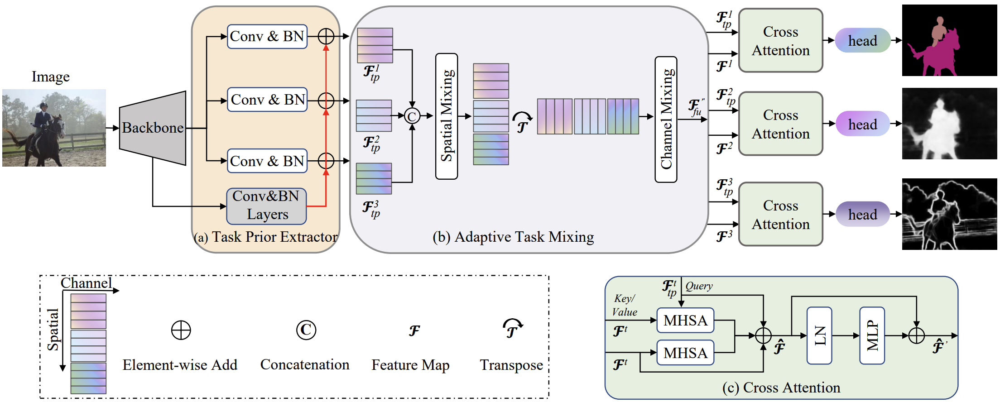

# Task prior attention network for multi-task learning of dense prediction


This repo is the official implementation of "TPANet" as well as the follow-ups. It currently includes code and models for the following tasks:


## Updates

***16/8/2025***
We release the code of TPANet.


## Introduction

**TPANet** 
Transformer-based methods have been popular for a variety of visual perception tasks due to their better global modeling via attention. However, a plain Transformer-based architecture is known for lacking inductive biases, which will impede the performance in multi-task learning (MTL) of dense prediction due to the incapability of capturing task-relevant prior information. 
To this end, we propose the Task Prior Attention Network (TPANet), which introduces task-relevant prior information into the whole architecture.
Our TPANet consists of three tailored modules: task prior extractor, adaptive task mixing, and cross attention modules. 
First, the proposed task prior extractor is applied for introducing task-relevant prior information with inductive biases via convolution for each task, adapting them to the downstream module simultaneously.
Second, to enhance task interaction efficiency, our method relies on the adaptive task mixing equipped with spatial and channel mixing to capture the task interaction.
Third, the proposed cross attention module is leveraged to query task-specific feature maps using task-relevant prior information via query-based attention.
Our method allows compatibility with different backbones.
TPANet (with Swin-L) performance surpasses the previous state-of-the-art by a large margin of +4.5 mIoU on NYUD-v2 dataset and +1.4 mIoU on PASCAL-Context dataset, demonstrating the potential of our method as a robust MTL model.
<div align=center></div>


## Main Results on Dense Prediction Datesets

**TPANet on NYUD-v2 dataset**

| model|backbone|#Params| FLOPs | SemSeg| Depth | Noemal|Boundary|
| :---: | :---: | :---: | :---: | :---: | :---: | :---: | :---: |
| TPANet | Swin-T | 34.69M  |164.9G  |46.51	 |0.5987  |20.71  |76.90|  
| TPANet | Swin-S | 53.34M  |185.25G |50.90	 |0.5603  |20.05	|78.20|
| TPANet | Swin-L | 205.61M |378.58G |56.42	 |0.5018 	|19.02	|79.10|

**TPANet on PASCAL-Contex dataset**

| model | backbone |  SemSeg | PartSeg | Sal | Normal| Boundary|
| :---: | :---:    | :---:   | :---:   | :---: | :---: | :---: |
| TPANet | Swin-T | 69.08| 57.61| 82.54| 14.46| 71.20 | 
| TPANet | Swin-S | 71.59| 60.38| 83.20| 14.65| 72.00|
| TPANet | Swin-B | 75.56 |64.91| 83.46| 14.67| 73.10|
| TPANet | Swin-L | 78.11 |68.01| 83.65| 14.38| 74.80|


## Getting Started
**Install and Data Prepare**

<!--Please reference to [MQTransformer](https://github.com/yangyangxu0/MQTransformer)-->

**Install with pip**

pip install pytorch-lightning==1.1.8

pip install torch==1.8.0

pip install scikit-learn==1.3.2

pip install scipy==1.10.1

**Datasets**

Dataset: PASCAL-Context and NYUD-v2. You can download the data from: [PASCALContext.tar.gz](https://hkustconnect-my.sharepoint.com/:u:/g/personal/hyeae_connect_ust_hk/ER57KyZdEdxPtgMCai7ioV0BXCmAhYzwFftCwkTiMmuM7w?e=2Ex4ab), [NYUDv2.tar.gz](https://hkustconnect-my.sharepoint.com/:u:/g/personal/hyeae_connect_ust_hk/EZ-2tWIDYSFKk7SCcHRimskBhgecungms4WFa_L-255GrQ?e=6jAt4c)

**Train**

To train TPANet model:
```
python ./src/main.py --cfg ./config/t-nyud/swin/baselinemt_swin_t_adanet.yaml --datamodule.data_dir $DATA_DIR --trainer.gpus 0,1,2,3,4,5,6,7
```

**Evaluation**

- When the training is finished, the boundary predictions are saved in the following directory: ./logger/NYUD_xxx/version_x/edge_preds/ .
- The evaluation of boundary detection use the MATLAB-based [SEISM](https://github.com/jponttuset/seism) repository to obtain the optimal-dataset-scale-F-measure (odsF) scores.


## Acknowledgement
This repository is based [ATRC](https://github.com/brdav/atrc). Thanks to [ATRC](https://github.com/brdav/atrc)!
